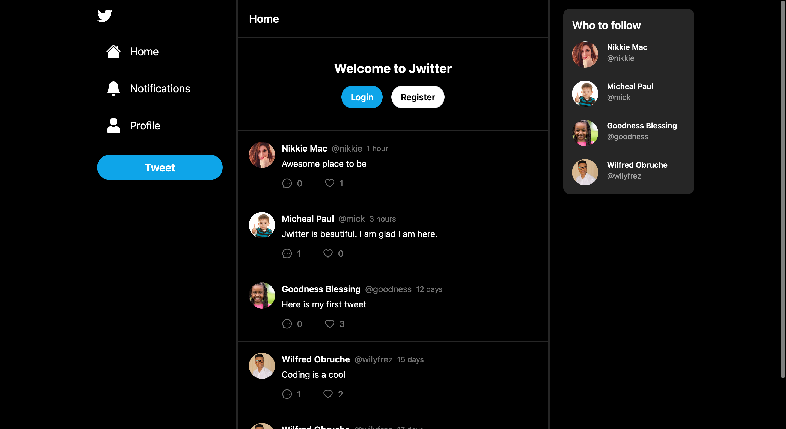

## Jwitter - A Twitter Clone Implemented With NextJs, Typepscript And MongoDB

[Jwitter](https://jwitter-nine.vercel.app/) is a Twitter clone web application built using Next.js, TypeScript, and MongoDB. It allows users to create accounts, post tweets, follow other users, like tweets, and perform other common Twitter functionalities.



I've been long intrigued by the idea of creating a Twitter clone that incorporates some of Twitter's innovative features. This curiosity ultimately drove me to develop Jwitter.

With [Jwitter](https://jwitter-nine.vercel.app/), I have effectively implemented key features and functionalities that are comparable to Twitter's. Users can currently register, login, post tweets, reply to tweets, like and unlike tweets, follow and unfollow other users, as well as receive notifications.

### Features

- User authentication and authorization with NextJs authentication
- User account creation and management
- Posting and replying tweets
- Following and unfollowing other users
- Liking and unliking tweets
- Profile page to view user's tweets, followers, and following
- Responsive design for optimal viewing experience on different devices

### Technologies Used

- **Next.js:** A React framework for building server-rendered React applications.
- **TypeScript:** A statically typed superset of JavaScript.
- **MongoDB:** A popular NoSQL database for storing JSON-like documents.
- **Tailwind CSS:** A modern CSS framework for building responsive and customizable user interfaces.
- **Prisma ORM:** An ORM that makes working with databases easy.
- **Zustand:** A small, fast and scalable state-management solution
- **SWR:** A React Hooks library for data fetching

### Getting Started

To get started with Jwitter, follow the steps below:

- Clone the repository:
  ```sh
  git clone https://github.com/wilfredcloud/jwitter.git
  ```
- Navigate to the project directory:
  ```sh
   cd jwitter
  ```
- Install dependencies:
  ```sh
  npm install
  ```
- Set up MongoDB database: Create a MongoDB database and provide the connection URL in the .env file as shown below
  ```sh
    DATABASE_URL=
    NEXTAUTH_JWT_SECRET=
    NEXTAUTH_SECRET=
  ```
- Start the development server:
  ```sh
  npm run dev
  ```
- Open your web browser and go to http://localhost:3000 to see Jwitter in action!

### Contributing

Contributions to Jwitter are welcome!

### License

[Jwitter](https://jwitter-nine.vercel.app/) is open-source software released under the MIT License.

### Acknowledgements

[Jwitter](https://jwitter-nine.vercel.app/) was built with the help of the following frameworks, libraries and resources:

    Next.js: https://nextjs.org/
    TypeScript: https://www.typescriptlang.org/
    MongoDB: https://www.mongodb.com/
    Tailwind CSS: https://tailwindcss.com/
    Prisma ORM: https://www.prisma.io/
    Zustand: https://docs.pmnd.rs/zustand/
    SWR: https://swr.vercel.app/

Special thanks to the developers of these tools for their amazing work!
